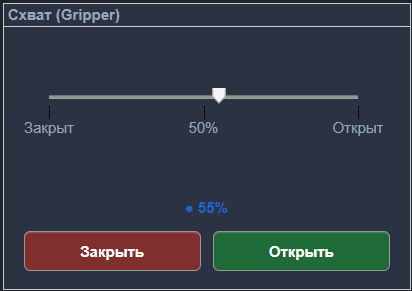
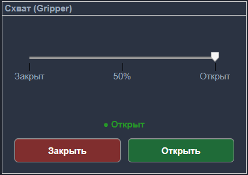
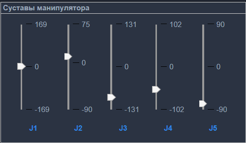
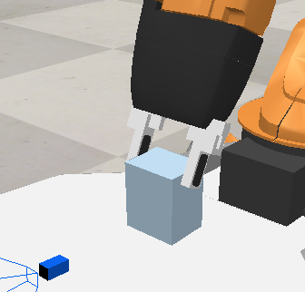
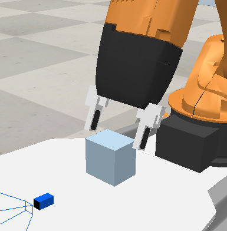
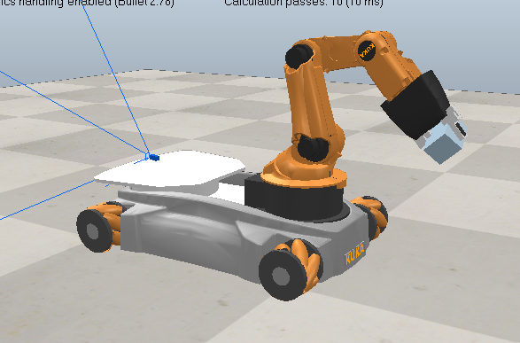

## Реализация панели управления KUKA YouBot в CoppeliaSim с использованием MATLAB
Данный проект представляет панель управления на основе MATLAB, разработанную для мобильного манипулятора KUKA YouBot, работающего в среде CoppeliaSim. Панель обеспечивает интуитивно понятный графический интерфейс и программный интерфейс для решения задач кинематики, планирования движений и симуляционной проверки алгоритмов управления роботом.
## О проекте
Проект реализует графическую панель управления (GUI) для виртуального робота KUKA YouBot в симуляторе CoppeliaSim. Связь между MATLAB и симулятором осуществляется через Legacy Remote API.
Панель позволяет управлять в реальном времени:
- колёсной базой (скорость и поворот),
- пятью суставами манипуляторной руки,
- захватом (схватом) с плавным позиционированием.
## Демонстрация управления 
|  |  |  |
|:---:|:---:|:---:|
| Панель — схват закрыт | Панель — схват открыт | Панель — произвольная конфигурация суставов |
|  |  |  |
|:---:|:---:|:---:|
|Схват закрыт | Схват открыт | Произвольная конфигурация суставов |
