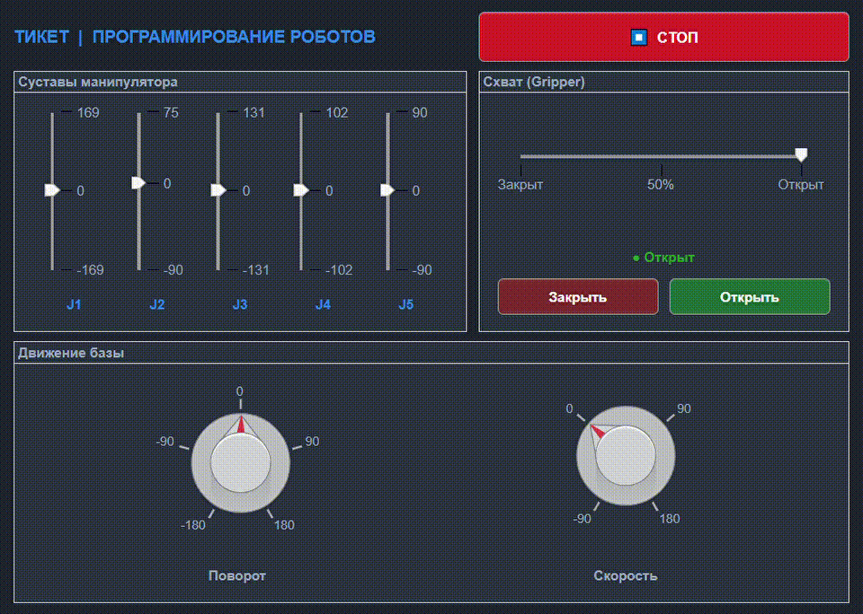

## Реализация панели управления KUKA YouBot в CoppeliaSim с использованием MATLAB
Данный проект представляет панель управления на основе MATLAB, разработанную для мобильного манипулятора KUKA YouBot, работающего в среде CoppeliaSim. Панель обеспечивает интуитивно понятный графический интерфейс и программный интерфейс для решения задач кинематики, планирования движений и симуляционной проверки алгоритмов управления роботом.
## О проекте
Проект реализует графическую панель управления (GUI) для виртуального робота KUKA YouBot в симуляторе CoppeliaSim. Связь между MATLAB и симулятором осуществляется через Legacy Remote API.
Панель позволяет управлять в реальном времени:
- колёсной базой (скорость и поворот),
- пятью суставами манипуляторной руки,
- захватом (схватом) с плавным позиционированием.
## Демонстрация управления 
Ниже представлены состояния графического интерфейса панели управления при различных воздействиях на робота — управление схватом и позиционирование суставов манипулятора. Каждое положение ползунков и кнопок на панели соответствует определённой конфигурации робота в симуляторе.
|  |  |  |
|:---:|:---:|:---:|
| Панель — схват закрыт | Панель — схват открыт | Панель — произвольная конфигурация суставов |

Соответствующие положения робота в симуляторе CoppeliaSim для каждого из показанных состояний панели представлены ниже. Можно наблюдать как изменения в интерфейсе напрямую отражаются на физической модели робота - открытие и закрытие схвата, а также произвольная конфигурация суставов руки манипулятора.
|  |  |  |
|:---:|:---:|:---:|
|Схват закрыт | Схват открыт | Произвольная конфигурация суставов |

Панель обеспечивает управление колёсной базой в режиме реального времени. Ниже представлены состояния интерфейса и соответствующее поведение робота в CoppeliaSim при движении вперёд и назад, управляемом с помощью ручки "Скорость".

|  |  |
|:---:|:---:|
| Панель при движении вперед/назад | Движение вперёд/назад в CoppeliaSim |

Помимо линейного движения, база поддерживает вращение на месте, управляемое ручкой "Поворот". Ниже показаны состояния интерфейса и соответствующее вращение робота в симуляторе.

|  |  |
|:---:|:---:|
| Панель при вращении | Вращение на месте в CoppeliaSim |

## Функциональность

| Подсистема | Описание | Реализация |
|---|---|---|
| **Колёсная база** | Движение вперёд/назад, поворот на месте | `simxSetJointTargetVelocity` на 4 колёсных сустава |
| **Манипулятор** | 5 суставов (J1–J5), диапазоны ±90°…±169° | `simxSetJointTargetPosition` |
| **Схват** | Плавное открытие/закрытие через ползунок и кнопки | Float signal `gripperTarget` → Lua child-script |
| **СТОП** | Мгновенная остановка базы | Обнуление скорости всех колёс |
| **Статус схвата** | Индикатор: Открыт / Закрыт / % | Метка в GUI |

